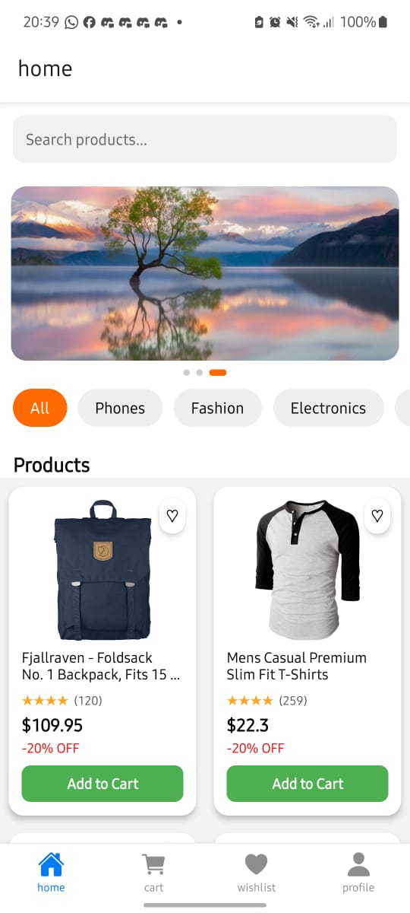
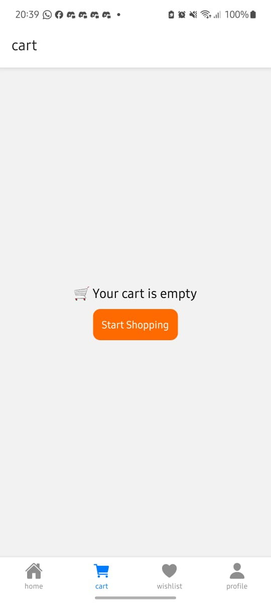
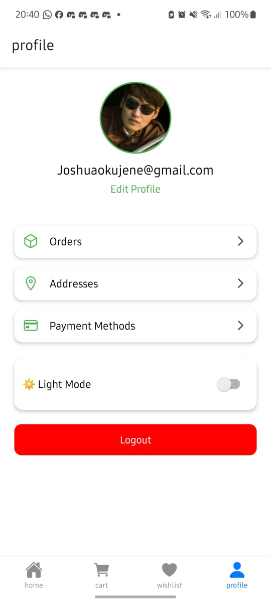

# Mobile E-Commerce Application

## Description

This is a fully functional mobile e-commerce application built using React Native and Expo.
The app allows users to browse products, view product details, add items to a cart, manage a wishlist, and complete a simulated checkout process.

The goal of this project is to demonstrate understanding of navigation, state management, persistent storage, UI design, and performance optimization in a real-world mobile application.

## Features Implemented

## Core Features

• Splash screen with automatic navigation

• Authentication system (Login & Register)

• Persistent login state using AsyncStorage

• Product listing screen with search functionality

• Product details screen with full information

• Add to cart functionality

• Cart management:

• Increase/decrease quantity

• Remove items

• View total price

• Checkout flow:

• Delivery form

• Payment method selection

• Order confirmation

• Cart clearing after checkout

• Profile screen:

• User details

• Profile image selection

• Logout functionality

## Bonus Features

• Dark mode

• Wishlist system (add/remove items)

• Move items from wishlist to cart

• Persistent cart and wishlist storage
• Smooth UI animations using Moti

## Tech Stack

• React Native

• Expo Router

• Context API (Cart & Wishlist state management)

• AsyncStorage (data persistence)

• Moti (animations)

## Folder Structure Explanation

The project is structured to ensure scalability and maintainability:

/app → Authentication, product [id], screens and navigation (Expo Router)

/components → Reusable UI components (e.g., ProductCard)

/context → Global state management (Cart, Wishlist, Auth)

/constants → Theme, colors, spacing

/assets → Images, icons, fonts

/hooks → useProduct

This structure separates concerns clearly:

• UI components are reusable

• Logic is centralized in context

• Screens remain clean and focused

## Screenshots

## Optimization Techniques Used

To improve performance and user experience, the following optimizations were applied:
• React.memo
Used in ProductCard to prevent unnecessary re-renders when props do not change.
• useCallback
Used for functions passed to child components to avoid recreating functions on every render.
• useMemo
Used where needed to memoize computed values such as totals and filtered product lists.

These optimizations help improve rendering performance, especially in lists.

## Challenges Faced

• State synchronization between Wishlist and Cart

Ensuring items could move seamlessly between wishlist and cart without duplication required proper state handling.

• Persistent storage with AsyncStorage

Managing loading and saving state without causing UI flicker or data loss required careful use of useEffect.

• Navigation conflicts

Handling nested pressable components (e.g., preventing navigation when pressing buttons inside cards) required event control using stopPropagation().

• UI consistency

Maintaining consistent spacing, typography, and layout across all screens required creating a shared theme system.
